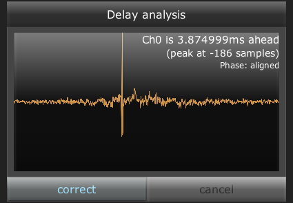
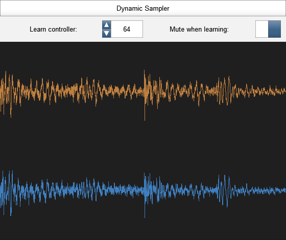
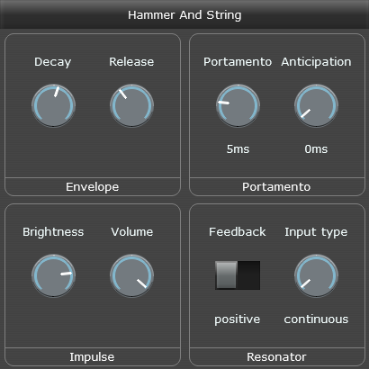
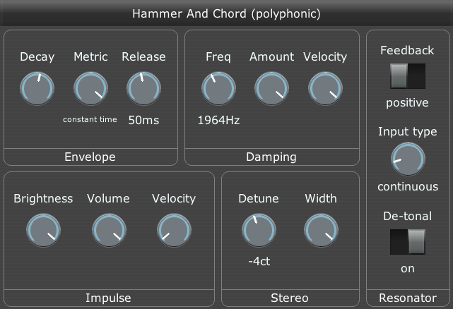
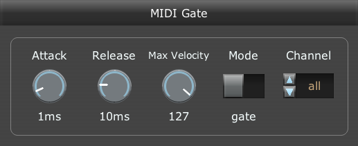
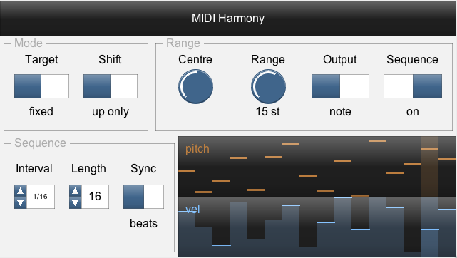

# Geraint's JSFX repository

This is a collection of audio effects I have written in REAPER's JSFX language.

Download them from [GitHub](https://github.com/geraintluff/jsfx), or [as a ZIP file](http://stash.reaper.fm/v/29933/Geraint%27s%20JSFX.zip), or on [ReaPack](https://reapack.com/) by adding the repository: https://geraintluff.github.io/jsfx/index.xml

* PadSynth - a synth that produces thick sounds, including per-note effects and modulators ([audio demo](audio-demos/padsynth.mp3))
* Spring-Box - an echo/chorus effect ([audio demo](audio-demos/spring-box.mp3))
* Bad Connection - simulate poor connections by flipping between two volumes ([audio demo](audio-demos/Bad Connection/radio-dropout.mp3)), distortion, and a feedback delay line ([audio demo 2](audio-demos/bad-connection-spring-box-glitch.mp3)).
* Sandwich Amp - distortion module with a before/after filter pair, width control and secondary input ([audio demo](audio-demos/sandwich-amp.mp3))
* Warble - a basic pitch-editing effect
* Spectrum Matcher - analyse the difference between an input and a model, and optionally correct with EQ
* Smooth Limiter - a limiter that aims to have the correction curve as smooth as possible
* Panalysis - visualise and manipulate the stereo field of the audio
* Stereo Alignment Delay - two-channel delay and phase/delay analysis
* Learning Sampler - a basic sampler that records incoming audio and plays it back
* Hammer And Chord - a polyphonic string resonator/synth ([audio demo](audio-demos/hammer-and-chord.mp3))
* Hammer And String - a monophonic string resonator/synth with portamento ([audio demo](audio-demos/hammer-and-string.mp3))
* Humonica - harmoniser ([audio demo](audio-demos/humonica.mp3))
* MIDI Gate - a velocity-sensitive MIDI-controlled gate. Audio passes through only when MIDI note is down. ([audio demo](audio-demos/midi-gate.mp3))
* MIDI Harmony - arpeggiator and auto-accompaniment plugin

Presets (RPL) for these effects can be downloaded from GitHub.

## PadSynth

This is a synth that specialises in smooth and thick sounds, with a bank of effects and assignable modulators that are calculated per-note. ([audio demo](audio-demos/padsynth.mp3), [additional audio demos](https://soundcloud.com/geraintluff/sets/padsynth-demo-tracks-2/s-xUWj6))

You can find more information and demos for this synth on its [main project page](https://github.com/geraintluff/jsfx-pad-synth).

The per-note effects can re-ordered and renamed, and the modulators can modulate any later effect in the chain, including other modulators.

## Spring-Box

Spring-Box is a chorus/echo effect based on a matrix of 4 delay lines feeding back into each other.  The delay lines vary in length according to the chorus parameters, so you can create a range of sounds from choruses and ambiences to space-like reverb effects.  ([audio demo](audio-demos/spring-box.mp3))

Early echoes can be suppressed to get a smoother sound (the "late bias" control), by using two parallel delay structures with different feedback ratios, and subtracting the results.

## Bad Connection

Bad Connection has three features:

* randomly change the audio between two volume levels.  It can be used to imitate [dodgy radios](audio-demos/Bad Connection/radio-dropout.mp3) or [glitchy CPU overloads](audio-demos/Bad Connection/cpu-overload.mp3).
* apply volume-independent distortion (response curve has logarithmic ripples)
* tempo-dependent feedback delay line, and the feedback line includes the [distortion](audio-demos/bad-connection-3-16-degrade.mp3) and [volume variation](audio-demos/bad-connection-4-16-clean-dissolve.mp3).  It can create clean sounds, [destruction](audio-demos/bad-connection-chaos.mp3), or [glitchy textures](audio-demos/bad-connection-spring-box-glitch.mp3)) (demo includes Spring Box for reverb).

## Sandwich Amp

Sandwich Amp is a distortion effect with a set of paired filters on either side, to provide a range of timbres.  ([audio demo](audio-demos/sandwich-amp.mp3))

The underlying distortion function is `tanh()` (which is a fairly "soft" distortion, as opposed to a hard clip), but it can be driven quite hard, and an offset can be added to get asymmetrical response.

The "width" parameter widens the sound before distortion and narrows it afterwards, so that the distortion sounds stable and central while preserving the stereo feel of the sound.  Similarly, the "filter" section applies a filter before the distortion, and then applies the inverse filter afterwards, which can provide distinctive distortion timbres.

It is also possible to supply a secondary input to the effect (channels 3 and 4) - this audio is added in before the distortion, but then subtracted again afterwards.

## Warble

Warble is a relatively basic pitch-editing plugin.  It analyses incoming audio, stores and displays it on a zoomable graph (middle mouse and scroll wheel). (demo: [original](audio-demos/warble-original.mp3), [minor correction](audio-demos/warble-subtle.mp3), [major alterations](audio-demos/warble-shifted.mp3), [formant LFO](audio-demos/warble-formant-mod.mp3))

There are three tools: nudge, erase and smooth.  You use these tools with the mouse (left/right buttons do different things) to define how much it should be shifted.  The current change amount is displayed in red.

The formant-correction on the shifting algorithm isn't perfect, so major corrections (e.g. 5 semitones or more) won't sound completely natural.

It doesn't (currently) separate notes from each other, or support automatic correction.  I haven't figured out how to make "undo" work properly, so that's something to look at in the future.

## Spectrum Matcher

Spectrum Matcher is a tool for comparing the spectrum/timbre of an input against a model, and optionally applying a correction filter.

The bottom half of the screen shows the short-term spectrum (green), the long-term spectrum (yellow), and the long-term reference spectrum (blue).

The top half of the screen shows the current difference between the long-term spectrums (red).  If correction is enabled, it shows the correction curve (white) and phase (dotted brown).  If the correction is frozen, it shows the frozen correction values in blue.

To disable correction and re-start/clear the long-term spectrum measurements, hit "Reset".  To start correction, hit "Correct".  Once correction is enabled, hit "Freeze" to set or update the fixed correction values.

It can learn new models from the incoming audio, and save this as a preset for later use:

This effect is quite CPU-intensive, so if you're not using it it could be good to bypass it.

## Smooth Limiter

This is a brick-wall limiter that aims to keep the correction curve smooth while remaining responsive.

It will recover completely from any peak in a fixed amount of time.  Both the attack and release follow a curve that is similar to a sinusoidal segment (`1 + cos(x)`), with the goal of reducing cross-modulation.

The "distortion" parameter changes the correction mode - at 0%, the correction is applied by scaling the output signal.  At 100%, the correction is applied using a non-linear distortion (smooth, not a hard-clip), which can sound good for some applications such as drums.  The display in the bottom-left shows the current correction response.

## Panalysis

This effect draws the incoming audio on a 2D plot, so you can visualise the stereo field.  You can also alter the width/pan using the controls.

* Centre-panned (mono) sounds will draw vertically
* Left-panned sounds will draw angled to the left, right-panned will draw to the right
* If the L+R channels are independent, the graph will have no defined clear direction (may appear round)

It's possible to rotate the field such that hard-left or hard-right inputs will output "inside out" (opposite phase in both output channels).  In this case, the Width dial will turn red - double-click the dial to reset it to the maximum "safe" width:

## Stereo Alignment Delay

A tool to make small delays to individual channels, including a delay analyser.

Delay amount can be displayed in ms or samples.  (It is stored in ms, so if you change sample rate then it will preserve delay length regardless of the display format).

The delay analyser detects when one channel is ahead/behind or out of phase with the other - this can be useful when trying to get phases to agree in a multi-mic setup.

## Learning Sampler

This sampler records samples from the incoming audio when in learning mode (selected by a controller switch), and plays them back when in playback mode.

To record the samples, set the appropriate controller to a value of 64 or above.  While this controller is down, when you play a MIDI note the sampler will remember the start/end positions in the buffer.  When you have recorded all the samples, reset the controller to 0, and it will enter playback mode.

Samples are scaled according to velocity - if you record at velocity 100 and then play back at velocity 110, the output will be louder than the original input.

It currently does handle sample-rate changes.

## Hammer And String

This effect is a monophonic string resonator.  It can provide its own impulse (to act as a synth) as well as resonating the incoming audio.  ([audio demo](audio-demos/hammer-and-string.mp3))

The portamento affects how quickly the resonator changes pitch.  The "Anticipation" control starts the portamento before the actual note (this adds latency), which can give more natural movement.  To produce a legato effect for the synth, provide a note with low velocity to change the resonator pitch without an audible impulse.

## Hammer And Chord

This effect is a polyphonic string resonator.  It can provide its own impulse (to act as a synth) as well as resonating the incoming audio (e.g. a drum loop).  ([audio demo](audio-demos/hammer-and-chord.mp3))

It has two resonators for each note (left and right) and they can be detuned ([audio demo](audio-demos/Hammer And Chord detune demo.mp3)).

If your input audio is tonal (e.g. speech) and those frequencies are coming through, the "de-tonal" setting puts a ring-modulator before each resonator to make it atonal. ([audio demo](Hammer And Chord ringmod demo.mp3))

## Humonica

This effect is a harmoniser - it works by periodically sampling the input, converting to a zero-phase impulse, and using that result to resynthesise notes. ([audio demo](audio-demos/humonica.mp3))

The resynthesised notes can sound very "bare", because they are made up of exact frequencies, however they can be softened with chorus. ([audio demo](audio-demos/humonica-spring-box.mp3) with Spring-Box chorus and reverb)

## MIDI Gate

This effect is a simple MIDI-controlled gate.  When a MIDI note is down (any MIDI note), the audio is passed through.  Note velocity controls the amplitude, with the loudest value (unit gain) being determined by the "Max Velocity" control. ([audio demo](audio-demos/midi-gate.mp3))

You can also use it with a fast-paced pattern to produce an effect similar to Bad Connection. ([audio demo](https://geraintluff.github.io/jsfx/audio-demos/midi-gate-fast.mp3))

## MIDI Harmony

This effect shifts MIDI notes up or down by octaves, to fit within a target range.  This can be used to fold whatever chord is being played by some other instrument into a particular region (e.g. one octave around Middle C).

It has a single-note and a chord mode.  It also has a built-in sequencer, which can be used as an arpeggiator (so it will play a pattern, but only using octave-shifted notes that you are already holding down).

It also has a MIDI-input mode - this way, instead of the target region or note being fixed (e.g. "one octave around Middle C") it is defined by a second input on a different MIDI channel (channel 16 by default).

This lets you very quickly take one MIDI input, and re-cast it into a different scale or a different chord.
