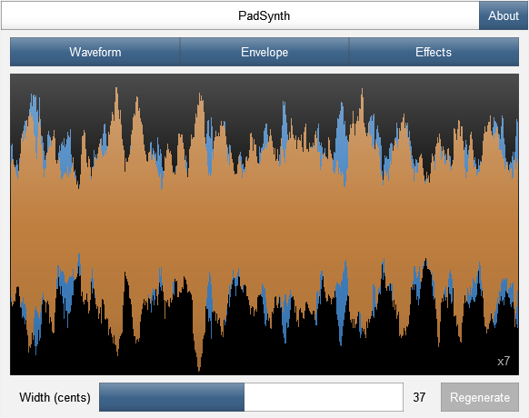
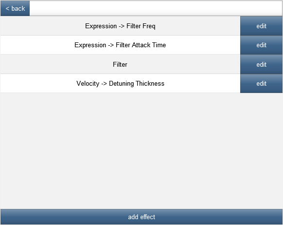
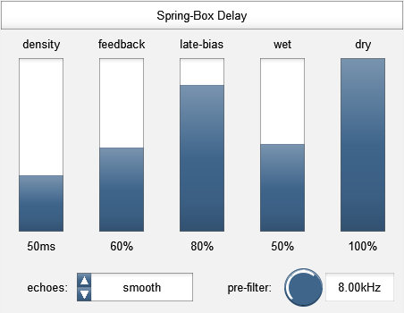
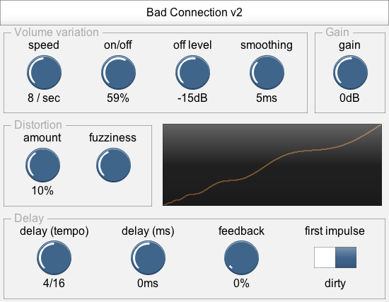
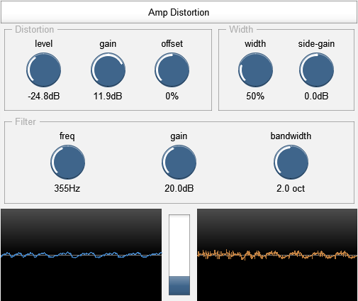
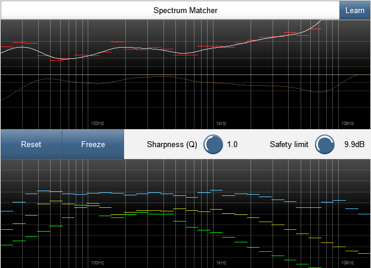
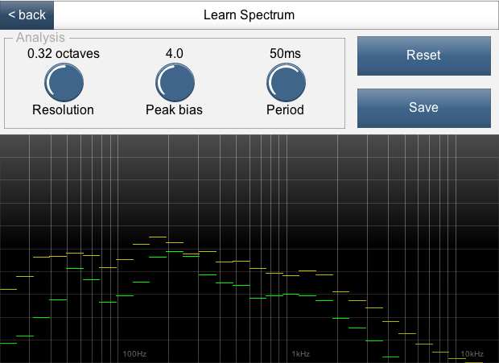
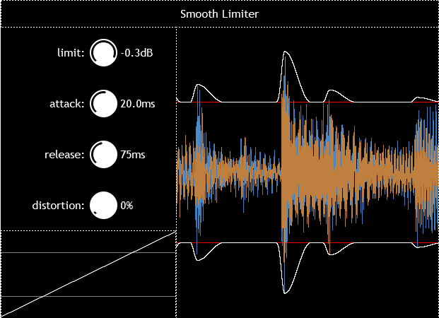

# Geraint's JSFX repository

This is a collection of audio effects I have written in REAPER's JSFX language.

Download them from [GitHub](https://github.com/geraintluff/jsfx) or on [ReaPack](https://reapack.com/) by adding the repository: https://geraintluff.github.io/jsfx/index.xml

* PadSynth - a synth that produces thick sounds, including per-note effects and modulators
* Spring-Box - an echo/reverb effect
* Bad Connection - flips between two volumes to simulate poor connection or dropouts
* Sandwich Amp - distortion module with a before/after filter pair, width control and secondary input
* Spectrum Matcher - analyse the difference between an input and a model, and optionally correct with EQ
* Smooth Limiter - a limiter that aims to have the correction curve as smooth as possible

Presets (RPL) for these effects can be downloaded from GitHub.

## PadSynth

This is a synth that specialises in smooth and thick sounds, with a bank of effects and assignable modulators that are calculated per-note. ([audio demo](audio-demos/padsynth.mp3))

You can find more information and demos for this synth on its [main project page](https://github.com/geraintluff/jsfx-pad-synth).

The per-note effects can re-ordered and renamed, and the modulators can modulate any later effect in the chain, including other modulators.

## Spring-Box

Spring-Box is a chorus/echo effect based on a matrix of 4 delay lines feeding back into each other.  The delay lines vary in length according to the chorus parameters, so you can create a range of sounds from choruses and ambiences to space-like reverb effects.  ([audio demo](audio-demos/spring-box.mp3))

Early echoes can be suppressed to get a smoother sound, by using two parallel delay structures with different feedback ratios, and subtracting the results.

## Bad Connection

Bad Connection is an effect that randomly changes the audio between two volume levels.  It can be used to imitate [dodgy radios](audio-demos/Bad Connection/radio-dropout.mp3) or [glitchy CPU overloads](audio-demos/Bad Connection/cpu-overload.mp3).

## Sandwich Amp

Sandwich Amp is a distortion effect with a set of paired filters on either side, to provide a range of timbres.  ([audio demo](audio-demos/sandwich-amp.mp3))

The underlying distortion function is `tanh()` (which is a fairly "soft" distortion, as opposed to a hard clip), but it can be driven quite hard, and an offset can be added to get asymmetrical response.

The "width" parameter widens the sound before distortion and narrows it afterwards, so that the distortion sounds stable and central while preserving the stereo feel of the sound.  Similarly, the "filter" section applies a filter before the distortion, and then applies the inverse filter afterwards, which can provide distinctive distortion timbres.

It is also possible to supply a secondary input to the effect (channels 3 and 4) - this audio is added in before the distortion, but then subtracted again afterwards.

## Spectrum Matcher

Spectrum Matcher is a tool for comparing the spectrum/timbre of an input against a model, and optionally applying a correction filter.

The bottom half of the screen shows the short-term spectrum (green), the long-term spectrum (yellow), and the long-term reference spectrum (blue).

The top half of the screen shows the current difference between the long-term spectrums (red).  If correction is enabled, it shows the correction curve (white) and phase (dotted brown).  If the correction is frozen, it shows the frozen correction values in blue.

To disable correction and re-start/clear the long-term spectrum measurements, hit "Reset".  To start correction, hit "Correct".  Once correction is enabled, hit "Freeze" to set or update the fixed correction values.

It can learn new models from the incoming audio, and save this as a preset for later use:

This effect is quite CPU-intensive, so if you're not using it it could be good to bypass it.

## Smooth Limiter

This is a brick-wall limiter that aims to keep the correction curve smooth while remaining responsive.

It will recover completely from any peak in a fixed amount of time.  Both the attack and release follow a curve that is similar to a sinusoidal function (`1 + cos(x)`), with the goal of reducing cross-modulation as much as possible.

The "distortion" parameter changes the correction mode - at 0%, the correction is applied by scaling the output signal.  At 100%, the correction is applied using a non-linear distortion (smooth, not a hard-clip), which can sound good for some applications such as drums.  The display in the bottom-left shows the current correction response.