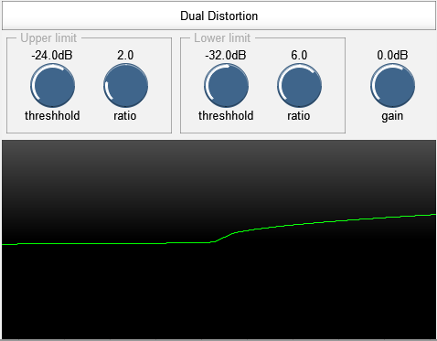

# Geraint's JSFX repository

This is a collection of audio effects I have written in REAPER's JSFX language.

Download them from [GitHub](https://github.com/geraintluff/jsfx) or on [ReaPack](https://reapack.com/) by adding the repository: https://geraintluff.github.io/jsfx/index.xml

* Bad Connection - flips between two volumes to simulate poor connection or dropouts
* Dual Distortion - simple distortion with asymmetric parameters
* Spectrum Matcher - analyse the difference between an input and a model, and optionally correct with EQ

There are also some presets (RPL) available for [Bad Connection](Bad Connection.rpl) and [Spectrum Matcher](Spectrum Matcher.rpl).

## Bad Connection

Bad Connection is an effect that randomly changes the audio between two volume levels.  It can be used to imitate [dodgy radios](audio-demos/Bad Connection/radio-dropout.mp3) or [glitchy CPU overloads](audio-demos/Bad Connection/cpu-overload.mp3).

## Dual Distortion

Dual Distortion is a simple clipping/distortion effect where you control the positive and negative sides independently.

## Spring-Box

Spring-Box is an echo effect based on a matrix of 4 delay lines feeding back into each other.  Early echoes can be suppressed to get a smoother sound, by using two parallel delay structures with different feedback ratios, and subtracting the results.  ([audio demo](audio-demos/spring-box.mp3))

## Spectrum Matcher

Spectrum Matcher is a tool for comparing the spectrum/timbre of an input against a model, and optionally applying a correction filter.

It can learn new models from the incoming audio, and save this as a preset for later use:

