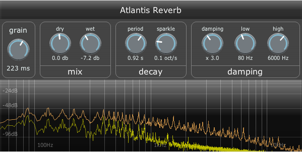

# Atlantis Reverb

This is a reverb that specialises in long ambient sounds and shimmering textures.

The "grain" size controls the frequency/time resolution.  Longer grains will give smooth and pure tones, which shorter ones will result in a thicker and more wavering result.

The "shimmer" control slowly morphs the reverb up by octaves over time, adding a bright and ethereal sound to the reverb.  The "fifths" dial lets you add some octave-and-a-fifth shifts in there as well, which may help the shimmer sound smoother, but may not sound as clean.

The "release" controls in the decay section allow you to move the current echoes over to a second, faster-decaying reverb line.  This can stop things getting as muddy when changing chord.  It can be triggered by mouse, automation, or MIDI controller #64 (if enabled).

If the quieter bits sound great, but the louder sections sound harsh, the "input comp" section can help you tame the peaks.
