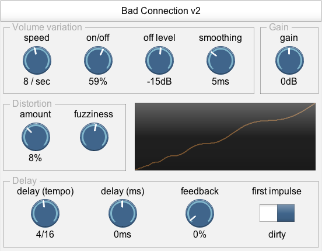

# Bad Connection

Bad Connection has three features:

* randomly change the audio between two volume levels.  It can be used to imitate [dodgy radios](audio-demos/Bad Connection/radio-dropout.mp3) or [glitchy CPU overloads](audio-demos/Bad Connection/cpu-overload.mp3).
* apply volume-independent distortion (response curve has logarithmic ripples)
* tempo-dependent feedback delay line, and the feedback line includes the [distortion](audio-demos/bad-connection-3-16-degrade.mp3) and [volume variation](audio-demos/bad-connection-4-16-clean-dissolve.mp3).  It can create clean sounds, [destruction](audio-demos/bad-connection-chaos.mp3), or [glitchy textures](audio-demos/bad-connection-spring-box-glitch.mp3)) (demo includes Spring Box for reverb).

