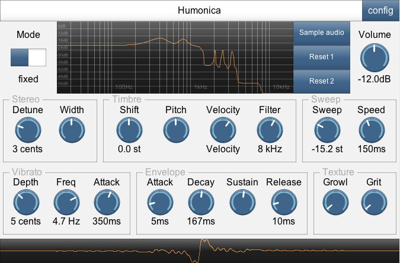

# Humonica

This effect is a harmoniser - it works by periodically sampling the input, converting to a zero-phase impulse, and using that result to resynthesise notes.

You can control how much audio is used to calculate the timbre (window) and how often (overlap).  There is a zero-latency mode ("live": notes are played instantly, but the timbre will be slightly behind), and a latency-compensated one.
