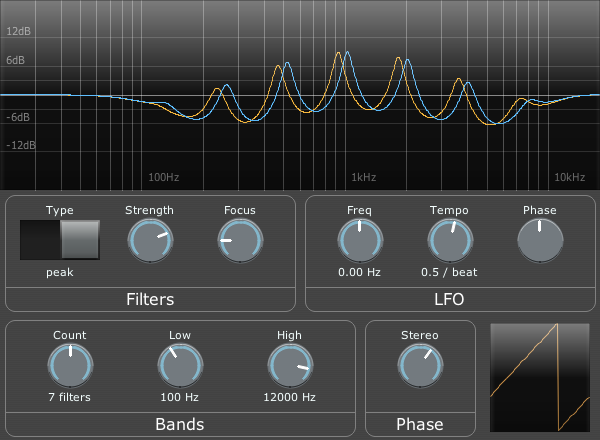

# Ripple

Ripple is a phaser-like effect which continually rises or falls.

The filters fade out (go to 0dB) at some definable limit, so you can modulate some areas of the spectrum while leaving others in tact.

It has a variable number of filters (up to 20), stereo phase-offset and a tempo-synced LFO.

