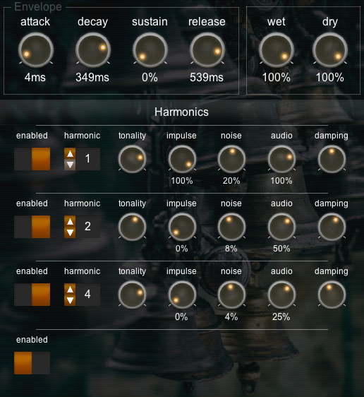

# Soft Bell

Soft Bell is a synth that produces chime-like tones, with individually specified harmonics.

It can also be used with audio - it can produce interesting inharmonic sounds from musical input, particularly if you turn the "tonality" dial down.

